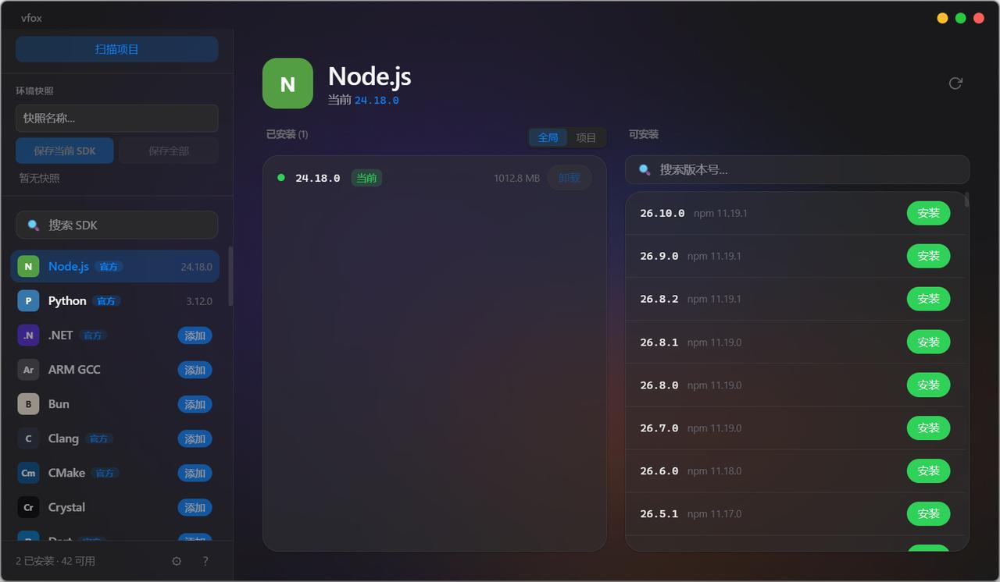

# vfox-gui

[](LICENSE)
[](https://tauri.app)
[](https://react.dev)

[vfox](https://github.com/version-fox/vfox) 版本管理器的桌面图形界面——**装 SDK、切版本、配项目环境，全程不用记一条命令。** 液态玻璃质感的原生窗口，中英双语，装完即用。

<p align="center">
  
</p>
<p align="center">
  
</p>

## 🚀 三步上手

1. **装好 [vfox](https://github.com/version-fox/vfox) 并至少添加一个插件**（没装也行，vfox-gui 会引导你）——SDK 本体由 vfox 下载管理，GUI 只是替你敲命令
2. **下载 vfox-gui**：[Releases](https://github.com/IKEASven69/vfox-gui/releases) 里拿 `*-setup.exe` 安装版，或 `*-portable-x64.zip` 便携版（解压即用、不写注册表、可放 U 盘）
3. **左侧选 SDK → 右侧点「安装」**——下载进度实时可见；装完点「切换」即全局生效，新开终端就能用

新版本发布时应用内自动更新，不用再来回下载。

### 常用玩法

- **项目锁版本**：顶栏「全局 / 项目」切到「项目」并选目录，切换版本时写入该目录的 `.tool-versions`——只对这个项目生效，同事 clone 下来环境一致；每次切换都记入时间线可回溯
- **不知道要装什么**：点「扫描项目」选中 clone 下来的代码，自动识别 `package.json` / `go.mod` / `Cargo.toml` / `requirements.txt` 需要的 SDK，缺哪个补哪个
- **环境快照**：发版前把整套 SDK 版本组合存成快照，出问题一键还原——支持只存某个 SDK 或全量
- **清理磁盘**：每个已安装版本旁直接显示占用大小，卸载不用的老版本

## ✨ 功能

- **📦 SDK 浏览**：侧边栏列出所有 vfox 支持的 SDK（Node.js、Python、Go、Rust、Java…），官方插件带 `官方` 标识
- **⚡ 一键操作**：安装（实时下载进度）、卸载、切换版本，全部在 UI 完成
- **🔍 模糊搜索**：侧边栏搜 SDK，详情页搜版本（支持 `lts`、`installed` 等标签）
- **🎯 项目级切换**：`.tool-versions` 项目锁版本 + 版本演进时间线
- **📂 扫描项目**：自动检测项目需要的 SDK，一键安装缺少的
- **💾 环境快照**：保存 / 恢复 SDK 版本组合（单 SDK 或全量）
- **📊 磁盘占用**：每个已安装版本旁显示磁盘大小
- **🌍 中英双语**：界面语言一键切换（含托盘菜单），首启跟随系统
- **🌓 暗色模式**：浅色 / 深色 / 跟随系统，液态玻璃在两种主题下自动适配
- **🖥️ 系统托盘**：最小化到托盘常驻，托盘菜单直达检查更新 / 更新 vfox
- **🔄 自动更新**：内置应用更新（启动时静默检查）+ vfox CLI 更新

## 📥 安装

| 方式 | 说明 |
|------|------|
| 安装包（推荐） | Releases 下载 `*-setup.exe`，双击安装 |
| 便携版 | Releases 下载 `*-portable-x64.zip`，解压双击 `vfox-gui.exe` 即可运行 |

**前提**：已安装 [vfox](https://github.com/version-fox/vfox) 并至少添加了一个插件；Windows 10+（64-bit）。没装 vfox？打开 vfox-gui 后会提示并提供安装链接。

## 🛠️ 从源码运行

```bash
pnpm install
pnpm tauri dev       # 启动开发服务器 + 热重载
```

需要 Rust 1.70+、Node.js 20+、pnpm。详细的项目结构与构建说明见 [CONTRIBUTING.md](CONTRIBUTING.md)。

### 技术栈

| 层 | 技术 |
|----|------|
| 桌面框架 | [Tauri 2](https://tauri.app) (Rust) |
| UI | [React 19](https://react.dev) + TypeScript + [react-i18next](https://react.i18next.com) |
| 样式 | Tailwind CSS v4 + CSS 自定义属性（液态玻璃 / 暗色主题） |
| 构建 | [Vite 7](https://vite.dev) |

## ⌨️ 快捷键

| 快捷键 | 功能 |
|--------|------|
| `Ctrl` / `Cmd` + `F` | 聚焦 SDK 搜索框 |
| `Ctrl` / `Cmd` + `,` | 打开设置 |
| `Ctrl` / `Cmd` + `/` | 打开帮助 |
| `Esc` | 关闭弹窗 |

## 🤝 贡献

欢迎提交 Issue 和 PR。开发与发布流程见 [CONTRIBUTING.md](CONTRIBUTING.md)。

## 📄 License

MIT © [vfox-gui contributors](https://github.com/IKEASven69/vfox-gui/graphs/contributors)
